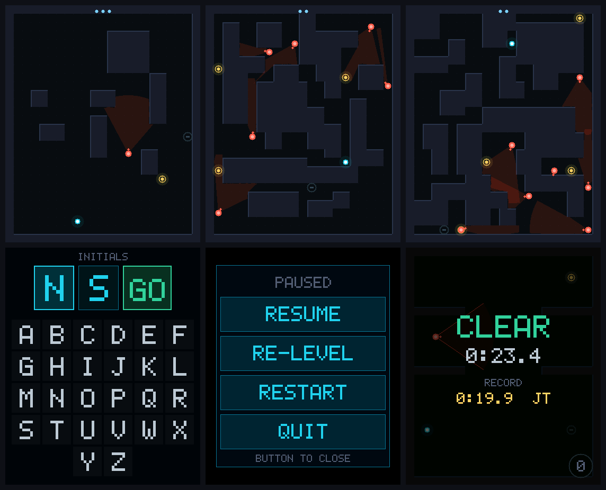
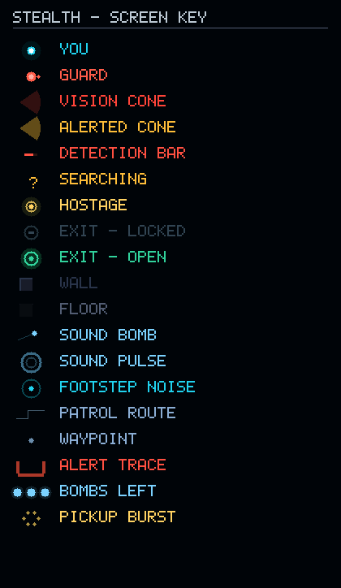

# Stealth — a tilt-controlled stealth game for the ESP32-S3 AMOLED 1.8

A realtime-tactics stealth puzzler that runs entirely on a palm-sized
[Waveshare ESP32-S3-Touch-AMOLED-1.8](https://www.waveshare.com/wiki/ESP32-S3-Touch-AMOLED-1.8)
(SKU 29957), inspired by [Stealth](https://store.steampowered.com/app/2168090/Stealth/).

Guards sweep vision cones across a tile maze. You tilt the board to move,
throw sound bombs to pull guards off their patrol, free the hostages, and
reach the exit without ever being fully seen. A heartbeat in the speaker rises
as a guard closes in on identifying you.

Everything runs on the board itself: 100 stages ordered by a measured
difficulty model, a software rasteriser redrawing the whole AMOLED panel at
50 FPS, a live synthesiser for every sound (there are no audio samples), and
per-stage best times saved to flash. Plain C on ESP-IDF 5.5, no other
frameworks.



## Hardware

The game needs nothing but the one board — no wiring, no add-ons. Plug it in
over USB-C and flash.

| | |
|---|---|
| **Board** | Waveshare ESP32-S3-Touch-AMOLED-1.8 (SKU 29957) |
| **SoC** | ESP32-S3R8 — dual-core Xtensa LX7 at 240 MHz, 512 KB SRAM, Wi-Fi and Bluetooth LE 5 |
| **Memory** | 8 MB octal PSRAM (in package), 16 MB flash |
| **Display** | 1.8" AMOLED, 368 × 448, QSPI — SH8601 or CO5300 driver depending on revision |
| **Touch** | Capacitive — FT3168 or CST816 depending on revision, over I²C |
| **Motion** | QMI8658 6-axis IMU (accelerometer and gyroscope) |
| **Audio** | ES8311 codec, onboard amplifier and speaker, microphone |
| **IO expander** | TCA9554 — the panel and touch reset lines hang off this, not off GPIO |
| **Buttons** | BOOT and PWR, on the side |
| **Power** | USB-C, or a 3.7 V Li-ion cell on the MX1.25 connector (AXP2101 PMIC) |
| **Also on board** | PCF85063 RTC, TF card slot |

### What the game uses

| Part | Role in the game | Code |
|---|---|---|
| AMOLED panel | the whole play field, fully redrawn every frame | [`board.c`](main/board.c), `espressif/esp_lcd_co5300` |
| Accelerometer | movement — tilt is the joystick | [`imu.c`](main/imu.c), [`tilt.c`](main/tilt.c), `waveshare/qmi8658` |
| Touch | tap to throw a bomb, hold to reveal patrol routes, menus | [`touch.c`](main/touch.c) |
| ES8311 + speaker | alarm, heartbeat, music, effects — all synthesised live | [`audio.c`](main/audio.c), [`synth.c`](main/synth.c), `espressif/esp_codec_dev` |
| BOOT button | pause menu, on every screen | [`button.c`](main/button.c) |
| Flash (NVS) | player initials and the best time on every stage | [`scores.c`](main/scores.c) |

The gyroscope, microphone, RTC, TF card slot, battery management and radios
are present but unused.

### Board revisions

Two revisions ship under the same SKU. The firmware tells them apart at boot
by probing the touch controller's I²C address, so one binary runs on both:

| | V1 | V2 |
|---|---|---|
| Panel | SH8601 | CO5300 (+16px column offset) |
| Touch | FT3168 @ `0x38` | CST816 @ `0x15` |

Both panels take the same command set, and both touch controllers are
FocalTech-derived with an identical register block for the first contact — so
a single 5-byte read at `0x02` serves either.

### Pin map

| Function | GPIO |
|---|---|
| LCD QSPI CS / CLK | 12 / 11 |
| LCD QSPI D0–D3 | 4, 5, 6, 7 |
| I²C SDA / SCL (400 kHz) | 15 / 14 |
| Touch interrupt | 21 |
| I²S MCLK / BCLK / WS | 16 / 9 / 45 |
| I²S DOUT (to codec) / DIN (from mic, unused) | 8 / 10 |
| Speaker amplifier enable | 46 |
| BOOT button | 0 |

One I²C bus carries the IO expander (`0x20`), the touch controller, the IMU
(`0x6B`, or `0x6A` on some units) and the codec's control port.

### Things about this board that cost real debugging time

1. **DMA straight from PSRAM needs an opt-in.** The SPI driver only accepts an
   external-RAM source when the transaction carries `SPI_TRANS_DMA_USE_PSRAM`,
   which esp_lcd sets only if you enable `flags.psram_dma_direct`. Without it
   the driver tries to bounce the whole frame through a 322KB *internal*
   buffer, which cannot be allocated, and you get
   `setup_dma_priv_buffer: Failed to allocate priv TX buffer`.

2. **…and even then, don't.** With framebuffers in PSRAM, DMA reading one
   while the CPU rasterises into the other saturates the PSRAM bus and the SPI
   peripheral underruns (`DMA TX underflow detected`). The renderer instead
   draws into two small internal-SRAM bands that ping-pong, so drawing and
   transfer overlap without ever sharing a bus.

3. **The speaker cannot reproduce bass.** It rolls off hard below roughly
   300–400Hz, so every sound is pitched for it rather than for headphones —
   see [Sound](#sound).

4. **The panel is a rounded rectangle**, not the square its framebuffer
   implies. See [Screen layout](#screen-layout).

5. **If tilt comes out mirrored**, the IMU's physical orientation relative to
   the panel is the only variable. Flip `IMU_SWAP_XY` / `IMU_INVERT_X` /
   `IMU_INVERT_Y` in [`main/imu.h`](main/imu.h); everything downstream is
   already in screen space.

## The idea

Sound is the currency. Tilt gently and you walk silently; tilt hard and you
run, which is fast and *loud*. Noise flood-fills through open tiles rather
than radiating in a circle, so it travels around corners but never through
walls — a bomb thrown down a side corridor genuinely pulls guards away from
the door they were watching.

The instant a guard resolves you from "something moved" into "someone is
there", their cone turns hot and an alarm stabs — the same `detecting` flag
drives both, so the sound always lands on the frame you see the colour change.

Detection is a meter, not a trigger. Being clipped by the edge of a cone for a
moment is survivable; standing in the middle of one is not. The meter traces
the panel's own outline: it starts at bottom centre, runs outward both ways,
rounds the lower corners, climbs both sides, rounds the upper corners, and the
two ends meet at top centre at the instant you are identified. It reads in
peripheral vision without looking away from the guard about to see you. You
can hear it happening too: the heartbeat's rate and volume both track the
closest guard's certainty.

Once you *are* seen, running is not an escape. A chasing guard moves at least
as fast as you are currently moving, so the only way out is to break line of
sight.

## Controls

| Action | Input |
|---|---|
| Move | **Tilt the board.** Speed rises continuously with the angle |
| Throw a sound bomb | **Tap** the field where you want it to land |
| Reveal patrol routes | **Press and hold** the field |
| Pause menu | **BOOT button**, on any screen after initials — Resume, Re-level, Restart, Quit |
| Menus | Tap |

Throwing resolves on *release*, not on press: until the finger lifts, a tap
and a hold are the same gesture, and a hold must not also lob a bomb.

Re-levelling and restarting live behind the button rather than on the field.
They used to compete with it for taps, which is what made throwing need a
separate arming step. Quit returns to the initials screen, so the next person
to pick the board up enters their own rather than inheriting the last one.

Speed is a continuous function of tilt angle, not a walk/run toggle: a slight
lean creeps, a hard lean sprints at 205 px/s. Past `SPRINT_THRESHOLD` your
footsteps start carrying, so the fastest route is rarely the quiet one.

Tilt is measured relative to a captured neutral, so you can play at any
comfortable angle. Neutral is captured at boot; choose
**Re-level** from the pause menu to reset it to however you are holding the
board now.

## Build and flash

Requires ESP-IDF v5.5+. On a machine that has never built the project:

```bash
./tools/bootstrap.sh
```

That checks for ESP-IDF, installs v5.5.5 if it is missing (no sudo), fetches
the pinned components, builds, and runs the whole off-device test suite.

After that:

```bash
./tools/check.sh    # every off-device test - no board needed
./flash.sh          # validate stages, build, flash
```

`flash.sh` picks the first `/dev/cu.usbmodem*` port and builds in
`/tmp/stealth-build`, outside the source tree; override either with `PORT=`
or `BUILD_DIR=`. Or by hand:

```bash
source ~/esp/esp-idf/export.sh && idf.py -B /tmp/stealth-build -p /dev/cu.usbmodem1101 flash monitor
```

Component versions are pinned in [`dependencies.lock`](dependencies.lock):
`esp_lcd_co5300` 2.1.0, `esp_codec_dev` 1.6.2, `qmi8658` 2.0.0.

## Stages and records

100 stages, all generated by [`tools/gen_levels.py`](tools/gen_levels.py) and
ordered by a measured difficulty score. There is no hand-built prologue: a
fixed-difficulty block spliced onto the front of a ramp puts a discontinuity
exactly where the curve should be gentlest. Stage 1 is two guards, one hostage
and three bombs, with a single briefly-watched crossing to time.

### Predicting how hard a stage is

Guard count, hostage count and wall density are the obvious knobs, and they are
weak predictors on their own. They shape generation here but are not what is
scored. What is scored is how hard the level is to actually move through:

- **Temporal coverage.** Each guard is walked around its full patrol cycle,
  including the dwell where it stands and sweeps, and its real vision cone —
  the game's FOV and range, clipped by line of sight — is accumulated per tile.
  A tile's coverage is the *fraction of the cycle* it is visible for. This is
  the correction that matters: a static union of cone positions scores a tile
  glimpsed once identically to one watched constantly. Guards are combined as
  independent observers, `1 - Π(1 - cᵢ)`, each normalised by its own cycle —
  normalising by the summed length of every cycle makes a tile under one
  guard's constant watch score `1/N` and flattens the whole signal.
- **Unavoidable watched chokepoints.** Articulation points whose removal
  disconnects spawn from exit, that also lie on the required tour. You cannot
  route around these, only time them, which is the hardest thing the game asks.
  Scored by the coverage of the worst one — 0.00 at stage 1, **0.92** at 100.
- **Cover.** How much of the map is never watched, and how far the route runs
  from the nearest unwatched tile. A chasing guard matches your speed, so
  breaking line of sight is the only escape; a route with no cover beside it
  has no recovery from a mistake.
- **Relief.** Bombs *per guard*, not bombs absolute — three against seven is
  scarcity.

### The one hard rule

**No stage can be completed without crossing ground a guard watches.** This is
a constraint, not a scoring term — a candidate that fails it is discarded.

Checking it properly means accounting for the fact that the player chooses the
route, and will choose whichever one keeps its worst moment lowest. So the
generator solves a bottleneck path: a max-metric Dijkstra giving, for every
pair of objectives, the minimum over all routes of the *worst* coverage along
it. Every ordering of the hostages is then tried and the best taken. If that
number is zero, a way through exists that never enters a cone, and the stage is
rejected.

Averaging coverage over one chosen route would not catch this: a stage can have
healthy average exposure on the direct path and still have a completely safe
detour beside it.

The floor is 0.16 — even stage 1 forces you across ground watched at least 16%
of a patrol cycle, and no stage has fewer than two guards.

Measured across the 100: forced crossing 0.16 → 0.92, worst choke 0.00 → 0.92,
guards 2 → 7, hostages 1 → 4. Candidates are sorted by score and sampled
evenly, so the ramp is monotonic by construction.

Fairness overrides difficulty: sealed border, fully connected floor, reachable
exit/hostages/waypoints, and no patrol may pass within vision range of the
spawn. Deterministic — regenerating reproduces the same stages byte for byte.

### Records

You enter two initials before playing. Each stage keeps its best time and who
set it in NVS, so records survive a power cycle. Records are keyed by stage
index, so the stage table is fingerprinted and saved times are discarded
whenever it changes — otherwise regenerating the stages would silently
reattach every record to a different map.

## Screen key

Every on-screen element, rendered from the game's own palette and rasteriser:



## Screen layout

The game uses the whole 368x448 panel — there is no HUD strip. The play field
is 23x28 tiles at 16px, which fills the panel exactly. The handful of things
that must stay visible float over the field instead of taking a band from it:
bombs remaining as dots on the top edge, and the alert meter tracing the
panel outline.

The panel is a rounded rectangle, not the square its framebuffer implies:
28.70mm of glass across 368px is 12.8px/mm, and the corner measures about 4mm,
so `SCREEN_CORNER_R` is 52px. Anything drawn outside that curve sits under the
bezel and is never seen. The alert trace follows it — a square path would
disappear at every corner.

When the last hostage is freed and the exit unlocks, a ring far wider than the
panel collapses onto the exit over 500ms — the one moment worth interrupting
your attention for, wherever on the screen you happened to be looking.

## Sound

There are no audio samples in flash — everything is synthesised live by
[`main/synth.c`](main/synth.c) into the ES8311 codec at 22.05kHz mono.

- **Detection alarm** — the loudest thing in the game, a tritone stab with a
  noise transient on the front. It fires on the exact frame a guard's cone
  turns hot, and ducks the music under itself so it punches.
- **Heartbeat** — two thumps (a loud "lub", a softer "dub" 30% of a cycle
  later), ramping from 52 to 168 BPM as tension climbs.
- **Music bed** — a slow unresolved drone in D minor at 76 BPM, with a sparse
  pulse on the bar and an occasional bell. A minor second fades into the drone
  *only* as tension rises, which is where the unease comes from. It stays
  quiet: it raises the floor, it does not ask to be listened to.

**Everything is pitched for this speaker, not for headphones.** The board's
speaker rolls off hard below roughly 300-400Hz, so the obvious choices — a
36Hz drone, a 62Hz heartbeat thump — are inaudible on the hardware no matter
how loud you make them. The first version of this made exactly that mistake:
98% of the music's energy sat below 250Hz and nothing could be heard.

Two things fix it. Fundamentals live inside the passband (the drone is
A4/D5/A5 rather than D1/A1), and every low-pitched sound uses `V_HARM`, which
sums a fundamental with its 2nd and 3rd harmonics — the harmonics land where
the speaker can move air and the ear still infers the missing fundamental.
The result moved the bed from 8.6% to 68.7% of its energy above 300Hz.

The inner loop uses a 1024-entry sine table and multiplicative envelopes
rather than `sinf`/`expf` per sample, which is what leaves room for a
continuous music bed under the one-shot effects.

The game thread and the audio task never share a lock — one-shot effects cross
between them through a single-producer/single-consumer ring, so a slow frame
can never stall audio and a busy synth can never stall a frame. Audio runs on
core 1; the game loop and renderer own core 0.

## Performance

368×448, fully redrawn every frame, measured on device on a 5-guard,
3-hostage stage with the alert meter active:

| | |
|---|---|
| Framerate | **50 FPS** (19ms/frame, with audio running) |
| Cone raycasting | 1.5 ms |
| Rasterising (4 bands) | 6.7 ms |
| QSPI DMA wait | 9.5 ms |
| Binary | 449 KB (71% of the app partition free) |
| Internal heap free | 110 KB |
| Main task stack peak | 2.4 KB of 8 KB |

The current stage set peaks at 8 guards (stage 99) and has not been
re-measured since it was generated. Three changes took the frame from 34.5 to 50 FPS:

- **Band height 32 → 112 rows** (14 bands → 4). Every band costs a synchronous
  window-set round trip before its pixels can stream, and that protocol
  overhead turned out to cost more than the rasterising did. This was worth
  more than every CPU optimisation combined.
- **No redundant clear.** `gfx_clear` painted the whole surface and
  `draw_floor` immediately painted over all of it — the frame was being filled
  twice. Every render path already covers the full surface, which
  `tools/host` verifies by poisoning the buffer and counting unpainted pixels.
- **Tile loops clipped to the band**, plus 32-bit-wide solid fills. Rasterising
  went 14.5ms → 6.7ms.

The frame is now bus-bound. QSPI still runs at the vendor-validated 40MHz, a
16.5ms floor for a full frame. Raising it is the one remaining lever —
`CO5300_PANEL_IO_QSPI_CONFIG` in [`main/board.c`](main/board.c) — but signal
integrity can only be judged by looking at the panel, so it is left at the
safe default.

## Project layout

```
main/
  main.c        init and the frame loop: banded rendering, events -> sound
  board.c       panel bring-up, revision detect, IO expander
  touch.c       unified FT3168 / CST816 driver
  imu.c         QMI8658 bring-up and sampling
  tilt.c        portable tilt filtering, levelling, response curve
  audio.c       ES8311 + I2S bring-up (thin platform shim)
  button.c      debounced BOOT button
  scores.c      initials and per-stage records in NVS
  synth.c       portable synthesiser: alarm, heartbeat, music, effects
  gfx.c         RGB565 software rasteriser (device-order pixels)
  font.c        5x7 bitmap font
  game.c        state, player, noise flood-fill, bombs, pathfinding
  guard.c       patrol / investigate / look / chase
  level.c       stage table access
  level_gen.c   the 100 generated stages - regenerate, don't hand-edit
  render.c      world and overlay drawing
  hud.c         input mapping, pause menu, initials entry, alert trace
tools/
  bootstrap.sh         first-run setup: ESP-IDF, components, build, tests
  check.sh             every off-device test in one command
  gen_levels.py        the stage generator and difficulty model
  validate_levels.py   static checks on the stage table
  ppm2png.py           PPM -> PNG, no dependencies
  host/                the game's own C, compiled natively
    inputtest.c        input handling and menu hit-test geometry
    routecheck.c       patrol-route overlay regression checks
    smoke.c            loads and simulates all 100 stages
    soak.c             long-run numerical soak
    tilttest.c         tilt filtering and levelling
    preview.c          renders real frames without a flash cycle
    capture.c          an autopilot run of any stage, as frames plus audio
    legend.c           renders docs/legend.png
    synthwav.c         renders the real synth to a WAV
```

## Testing without hardware

The game core — `game.c`, `guard.c`, `gfx.c`, `render.c`, `hud.c`, `level*.c`,
`synth.c` and `tilt.c` — has no ESP-IDF dependencies. Platform code passes data *in*
(tilt, touch, button) rather than the core calling *out*, so the same sources
compile natively against a stub `esp_err.h` in `tools/host/`. That is what
makes the whole test suite possible without a board:

```bash
./tools/check.sh
```

It runs, and exits non-zero if any fail:

- **`validate_levels.py`** — row widths, sealed borders, exactly one spawn and
  exit, and — via flood fill — that every hostage, the exit, and every guard
  waypoint is actually reachable from the player's start. A single miscounted
  character in a map is invisible by eye.
- **`inputtest.c`** — tap/hold/throw resolution and menu hit-testing, including
  that QUIT from every screen reaches the initials entry.
- **`routecheck.c`** — that the patrol-route polyline never blends a pixel
  twice (on one surface *and* through a banded render, using 14 bands — stricter
  than the device's 4), and that the route drawn is the route walked: a guard is
  simulated along its patrol and every tile it occupies must lie on the drawn
  corridor.
- **`smoke.c`** — loads and simulates every stage, and asserts that no guard
  can see the player at the moment a stage begins. That check caught a
  generated stage which spotted and captured the player within 1.5 seconds of
  starting, before they had moved.
- **`soak.c`** — 108,000 simulated frames across a dozen stages and four
  minutes of audio, checking for NaN, infinities and out-of-bounds positions —
  the kind of accumulated float drift that only appears in a long session and
  never in a short test.
- **`tilttest.c`** — that a board held still never moves the player, at any
  attitude it was powered on in, with or without hand tremor; that a real lean
  still reads as full tilt; and that a dead sensor decays to neutral.

The harnesses also render. This produces real frames from the real code
without a flash cycle:

```bash
clang -O2 -std=c11 -I main -I tools/host tools/host/preview.c \
  main/gfx.c main/font.c main/game.c main/guard.c main/level.c main/level_gen.c \
  main/render.c main/hud.c -lm -o /tmp/stealth_preview && /tmp/stealth_preview /tmp/shots
```

`tools/host/capture.c` goes further: an autopilot plays a whole stage and the
recorder writes every frame plus the synth's audio for the same run, which is
how the gameplay video on [todd.sh/StealthGame](https://www.todd.sh/StealthGame)
was made. Its header has the build and encode commands.

And this renders the exact code driving the speaker to a WAV, which is how the
speaker-passband work above was measured without a speaker in hand:

```bash
clang -O2 -std=c11 -I main tools/host/synthwav.c main/synth.c -lm -o /tmp/synthwav && /tmp/synthwav out.wav
```

## Failure handling

A handheld device that wedges has to be power-cycled, so the paths that could
hang or run away are bounded rather than trusted:

- The wait for a panel transfer is bounded, not `portMAX_DELAY`. Only the
  transfer-complete callback gives that semaphore, so a transfer that never
  finishes would otherwise wedge the game permanently. A failed
  `draw_bitmap` also hands the token back, since no callback will arrive for
  a transfer that was never queued.
- If the IMU stops answering, tilt decays to neutral instead of holding its
  last value — a stuck reading would walk the player into a wall forever with
  no way to stop.
- The touch read uses an 8ms timeout because it sits inside the frame loop; at
  50fps a wedged controller holding the bus for 20ms would halve the framerate
  rather than drop one sample.
- Guard counts from level data are clamped to `MAX_GUARDS` rather than
  trusted, and a zero-length synth voice is clamped before it can divide by
  zero and push a NaN through the whole mix.

The `i2s_common: i2s_channel_disable` error logged once at boot comes from the
codec framework closing a channel it has not opened yet. It is benign.

## Possible next steps

- Remember the furthest stage reached, so a session can resume there rather
  than at stage 1 (records already persist; progress does not)
- Guards that hear *each other* — a chasing guard alerting nearby patrols
- Use the gyro as well as the accelerometer, so quick flicks read as intent
- Re-measure frame time on the heaviest 8-guard stages

## License

[MIT](LICENSE) © 2026 Todd Sherman
