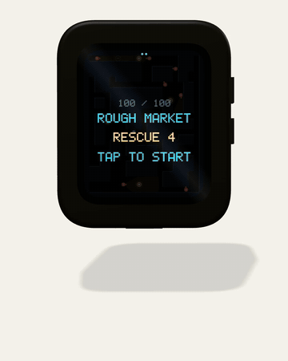

# Stealth Game — ESP32-S3 + Waveshare AMOLED

[](https://github.com/toddsherman/stealth-esp32s3/actions/workflows/ci.yml)
[](LICENSE)

**A tilt-controlled stealth game for the Waveshare ESP32-S3-Touch-AMOLED-1.8.**
Sneak past guards, throw sound bombs, rescue hostages, and reach the exit.
One board, no wiring: the accelerometer is your joystick, the touchscreen aims
bombs, and a synthesised heartbeat tells you how close you are to being caught.

Written in **C with ESP-IDF 5.5.5**. A hundred generated stages, a software
renderer measured at **50 FPS**, and live audio synthesis on a pocket-sized
ESP32-S3 board. No game engine or audio samples.

<p align="center">
  <a href="https://www.todd.sh/StealthGame">
    
  </a>
</p>

<p align="center"><a href="https://www.todd.sh/StealthGame"><strong>Watch the full run with sound →</strong></a></p>

The animation is stage 100 played by an autopilot through the actual C game
code, compiled on a computer. A 3D model of the board leans by the tilt the
autopilot applied on each frame, while its screen shows the game's own frames.
It is a render, not camera footage. [How it was made](docs/gameplay.md).

[Quick start](#quick-start) · [Hardware](#hardware) · [Controls](#controls) ·
[Code to explore](#code-to-explore) · [Engineering notes](docs/engineering.md) ·
[Contributing](CONTRIBUTING.md)

## Why explore the code?

If you're building an ESP32 game or working with a Waveshare AMOLED board,
there are useful examples here beyond the game itself:

- **QSPI display rendering:** internal-SRAM bands overlap drawing and DMA,
  avoiding PSRAM bus contention. The measured frame rate rose from 34.5 to
  50 FPS on a five-guard stage. [Measurements and limits](docs/engineering.md#performance).
- **Tilt input:** neutral calibration and filtering keep a stationary board
  still, even when powered on at an angle.
- **ES8311 audio:** a live synthesiser runs alongside the game, with harmonics
  chosen for the small onboard speaker.
- **Board revision handling:** runtime detection for SH8601/FT3168 and
  CO5300/CST816 display/touch combinations.
- **Testable embedded C:** the simulation, renderer, synthesiser and tilt
  filter also compile on a computer. Run all six test suites without a board
  or ESP-IDF.
- **Procedural stages:** 100 deterministic levels ranked by measured patrol
  coverage, exposure and route difficulty.

## Quick start

### Explore without hardware

You need Git, Python 3, Bash and Clang. On macOS, Clang comes with the Xcode
Command Line Tools; on Debian/Ubuntu, install `git python3 clang`.

```bash
git clone https://github.com/toddsherman/stealth-esp32s3.git
cd stealth-esp32s3
./tools/check.sh
```

This validates the stages and runs input, patrol-route, smoke, soak and tilt
checks. A successful run ends with `ALL CHECKS PASSED`.

### Build and flash the Waveshare board

The firmware targets **ESP-IDF v5.5.5** and the board listed below. Start with
Espressif's [ESP-IDF prerequisites and installation guide](https://docs.espressif.com/projects/esp-idf/en/v5.5.5/esp32s3/get-started/).
The macOS setup shortcut checks for an existing SDK, installs v5.5.5 if needed,
runs the host tests, and builds the firmware:

```bash
./tools/bootstrap.sh
```

Connect the board with a USB data cable, then flash on macOS:

```bash
./flash.sh
```

With ESP-IDF already activated on Linux, macOS or in the Windows ESP-IDF
terminal, use its commands directly:

```bash
idf.py build
idf.py -p PORT flash monitor
```

Replace `PORT` with your board's serial port, such as `/dev/ttyACM0` on Linux,
`/dev/cu.usbmodem…` on macOS, or `COM3` on Windows. Exit the monitor with
**Ctrl+]**. The default target is `esp32s3`; dependencies are pinned in
[`dependencies.lock`](dependencies.lock).

The convenience scripts use `/tmp/stealth-build`; plain `idf.py` uses `build/`.
If flashing cannot connect, close other serial monitors and check that your
USB cable carries data. See the [board's flashing instructions](https://www.waveshare.com/wiki/ESP32-S3-Touch-AMOLED-1.8)
for entering download mode.

## Hardware

This firmware is for the **[Waveshare ESP32-S3-Touch-AMOLED-1.8](https://www.waveshare.com/wiki/ESP32-S3-Touch-AMOLED-1.8)**
(SKU 29957). Other ESP32/Waveshare boards need a port; matching the chip alone
is not enough because display, touch, motion and audio wiring differ.

| Component | Used for |
| --- | --- |
| ESP32-S3R8, 8 MB PSRAM, 16 MB flash | Game, rendering and stored records |
| 1.8-inch 368 × 448 QSPI AMOLED | Play field and perimeter alert meter |
| QMI8658 accelerometer | Tilt movement |
| FT3168 or CST816 capacitive touch | Bomb aiming, patrol routes and menus |
| ES8311 codec and onboard speaker | Music, effects and heartbeat |
| BOOT button | Pause, re-level, restart and quit |

The firmware includes V1/V2 detection: SH8601 + FT3168 for V1, CO5300 + CST816
for V2. See [board revisions and pin mapping](docs/engineering.md#board-revisions)
and [hardware lessons](docs/engineering.md#things-about-this-board-that-cost-real-debugging-time).

## Controls

| Action | Input |
| --- | --- |
| Sneak / run | Tilt gently / steeply; running makes noise |
| Throw a sound bomb | Tap where it should land |
| Reveal guard patrols | Press and hold the field |
| Pause / re-level / restart / quit | Press BOOT, then tap a menu option |

Rescue every hostage before heading for the exit. If movement drifts, hold the
board at your comfortable playing angle and choose **Re-level** in the pause
menu. [Screens and visual key](docs/engineering.md#screen-key).

## Code to explore

| Area | Start here |
| --- | --- |
| Display bring-up and board revisions | [`main/board.c`](main/board.c) |
| Banded software rendering | [`main/main.c`](main/main.c), [`main/gfx.c`](main/gfx.c), [`main/render.c`](main/render.c) |
| Motion input and calibration | [`main/imu.c`](main/imu.c), [`main/tilt.c`](main/tilt.c) |
| Touch and menus | [`main/touch.c`](main/touch.c), [`main/hud.c`](main/hud.c) |
| Live sound synthesis | [`main/synth.c`](main/synth.c), [`main/audio.c`](main/audio.c) |
| Guard AI, sound propagation and pathfinding | [`main/game.c`](main/game.c), [`main/guard.c`](main/guard.c) |
| Stage generation and scoring | [`tools/gen_levels.py`](tools/gen_levels.py) |
| Tests, frame rendering and gameplay recording | [`tools/host/`](tools/host/) |

The [engineering reference](docs/engineering.md) preserves the full hardware
notes, difficulty model, speaker measurements, rendering benchmarks and failure
handling. The [project write-up](https://www.todd.sh/StealthGame) tells the story
of building and debugging it.

## Contributing

Board-revision reports, reproducible bug reports, tests and ports are welcome.
You can work on the portable game core without owning the hardware. See
[CONTRIBUTING.md](CONTRIBUTING.md) for setup, useful starting points and what to
include with a change.

If this is useful for your ESP32 project, **star the repository** so you can find
it again. If you adapt it to another board, an issue or pull request documenting
the port would help the next developer.

## License and credit

[MIT](LICENSE) © 2026 Todd Sherman. The game premise is inspired by
[Stealth on Steam](https://store.steampowered.com/app/2168090/Stealth/).
This is an independent project, not an official Waveshare or Espressif demo.
